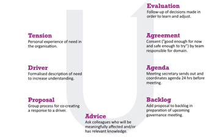

# From Tension to Agreement

In most cases, when we feel tension, we want to close it as soon as possible. Tension relief feels good. But that does not necessarily mean that we should. Most of the times, closing the tension gap the right way is better than doing it the quick way.

So instead of going directly from tension to action, we go deeper into the bottom of the U and then back up. When doing so, we save valuable time and energy in the long run. After all, we all know the shady side of acting too quick without understanding the full scope of things. As U.S. Navy Seals puts it: "slow is smooth, smooth is fast". So, we move slowly, hence we move smoothly and fast. The U process takes us from personal to collective and from abstract to concrete. We'll guide you through all the steps.

